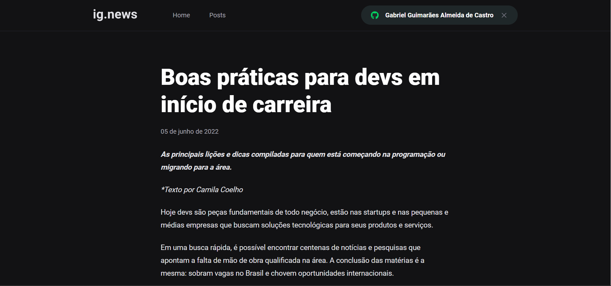

# IG News

## :zap: About

IgNews is an application that looks like a blog where people can subscribe and pay monthly to access all posts. The persons who post the content can use [Prismic](https://prismic.io/) to edit the posts. The payments uses [Stripe](https://stripe.com/en-br).

This application was built during the Ignite from [Rocketseat](https://rocketseat.com.br/). During the chapter, a lot of important topics and important libraries in frontend development are used. The main ones are

- [Next.js](https://nextjs.org/) - a [ReactJS](https://reactjs.org/) framework that allows server-side rendering (SSR), static site generation (SSG), route pre-fetching and still can be used normally in client side.
- [SASS](https://sass-lang.com/) - a CSS language extension that is the base for many other libraries.
- [JAM stack](https://jamstack.org/) - JavaScript, API, and Markup is a new architecture for web applications to make applications faster, more secure, and easier to scale.
  One of the concepts is to build pages with static generation and give more power to the frontend through a server-side part that can be helpful to access directly database and other APIs without compromising the security of the site.
- Concepts like the use of webhooks for example when is needed to receive data from events in external APIs like [Stripe](https://stripe.com/en-br), use of content management systems like [Prismic](https://prismic.io/). The application was built using specific APIs, but the main concepts are universal and can be reused.

## :rocket: Installation and Execution

<pre><code>
  # Install
  $ yarn # ou npm install
  # Execute
  $ yarn dev # ou npm run dev
</code></pre>

## :camera: Images

  

  

  

  

